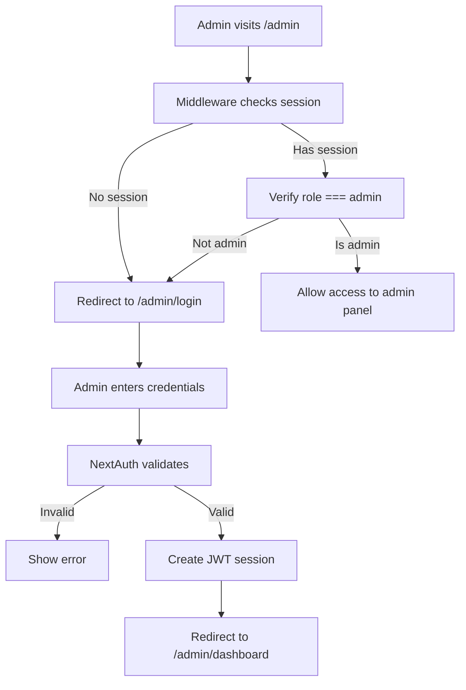
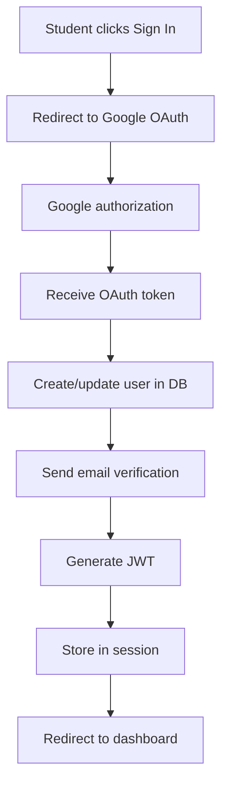
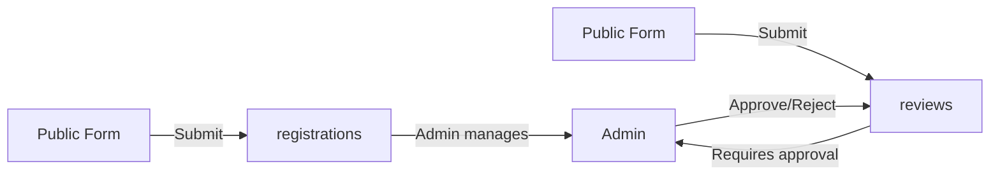
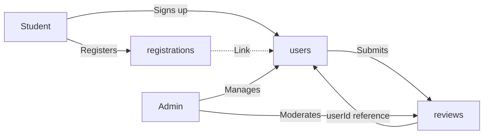

# System Architecture Documentation

## Overview

This document explains the technical architecture decisions, database design, and future extensibility considerations for the Youth Forum admin system.

## Architecture Principles

### 1. Separation of Concerns

- **Admin authentication** is completely separate from future user authentication
- Admin uses NextAuth credentials provider
- Students will use Google OAuth + JWT (future)
- No coupling between admin and user auth logic

### 2. Future-Ready Design

- Database schema designed for features not yet implemented
- Optional relationships allow backward compatibility
- Additive-only changes (no breaking migrations)

### 3. Security-First Approach

- **Server-side verification** for all role checks
- Never trust client-side role claims
- Middleware protection on all admin routes
- Password hashing with bcrypt (12 rounds)
- JWT sessions with 24-hour expiry

## Database Schema Design

### Collections

#### **users**

Primary collection for all authenticated entities (students and admins).

```typescript
{
  _id: ObjectId,

  // Authentication
  email: String (unique, indexed),
  emailVerified: Boolean,
  googleId: String (sparse, unique) // For future OAuth
  password: String, // Only for admins

  // Profile
  name: String,
  phone: String,
  college: String,
  city: String,
  avatar: String,
  bio: String (max 500 chars),

  // Authorization
  role: "student" | "admin",
  profileStatus: "incomplete" | "active" | "suspended",

  // Timestamps
  joinedAt: Date,
  createdAt: Date (auto),
  updatedAt: Date (auto)
}
```

**Indexes:**

- `email` (unique)
- `role`
- `profileStatus`
- Compound: `(role, profileStatus)`

**Design Rationale:**

- Single collection for all users simplifies queries and maintains consistency
- `role` field enables role-based access control (RBAC)
- `profileStatus` allows admin control over user accounts
- `googleId` prepared for OAuth integration
- `password` only required when `role === "admin"`

#### **registrations**

Student registration submissions (pre-authentication).

```typescript
{
  _id: ObjectId,

  // Student info
  name: String,
  email: String (indexed),
  phone: String,
  college: String (indexed),
  currentCity: String,
  permanentAddress: String,
  message: String,

  // Admin management
  contacted: Boolean (indexed),
  internalNote: String,
  status: "pending" | "contacted" | "accepted" | "rejected",

  // Future: Link to user account
  userId: ObjectId → users._id (optional, indexed),

  // Timestamps
  createdAt: Date (indexed)
}
```

**Design Rationale:**

- Works independently without user accounts
- `userId` is optional: allows linking when user signs up
- Admin can convert registrations to user accounts in future
- `contacted` boolean for quick filtering
- `internalNote` for private admin comments

#### **reviews**

Student feedback and testimonials.

```typescript
{
  _id: ObjectId,

  // Review content (guest submissions)
  name: String,
  email: String,
  college: String,
  rating: Number (1-5),
  review: String (max 1000 chars),

  // Moderation
  approved: Boolean (indexed),
  moderatedBy: ObjectId → users._id,
  moderatedAt: Date,
  rejectionReason: String,

  // Future: User ownership
  userId: ObjectId → users._id (optional, indexed),

  // Timestamps
  createdAt: Date (indexed),
  updatedAt: Date (auto)
}
```

**Indexes:**

- `approved`
- `userId`
- `college`
- Compound: `(approved, createdAt)`

**Design Rationale:**

- Supports both guest and authenticated reviews
- `approved` workflow for content moderation
- Public API only exposes `approved: true` reviews
- `userId` allows future review ownership
- `moderatedBy` tracks which admin approved/rejected

## Authentication Flow

### Admin Authentication



**Components:**

1. **Middleware** (`middleware.ts`) - Protects routes before handler execution
2. **NextAuth** (`/api/auth/[...nextauth]`) - Handles authentication logic
3. **RBAC** (`lib/rbac.ts`) - Server-side authorization utilities
4. **Session** - JWT stored in HTTP-only cookie (24hr expiry)

### Future: Student Authentication



**Separation:**

- Different NextAuth providers (Credentials vs Google)
- Different callback URLs
- Different session strategies if needed
- User role determines available features

## Relationships & Data Flow

### Current Implementation



### Future with User Accounts



## Security Architecture

### Defense Layers

1. **Network Layer**
   - HTTPS in production
   - CORS configuration
   - Rate limiting (future)

2. **Application Layer**
   - Middleware route protection
   - NextAuth session management
   - Password hashing (bcrypt, 12 rounds)

3. **Data Layer**
   - Input validation (Zod schemas)
   - Server-side role checks
   - SQL injection N/A (using MongoDB)
   - Password field excluded from JSON responses

4. **Business Logic Layer**
   - `requireAdmin()` wrapper on all admin actions
   - Role verification from encrypted JWT
   - Never trust client-provided role

### Attack Prevention

| Attack Vector       | Mitigation                                 |
| ------------------- | ------------------------------------------ |
| Unauthorized access | Middleware + JWT verification              |
| Role escalation     | Server-side role checks in every action    |
| Password exposure   | Bcrypt hashing + toJSON filtering          |
| Session hijacking   | HTTP-only cookies + 24hr expiry            |
| CSRF                | NextAuth CSRF protection                   |
| XSS                 | React auto-escaping + CSP headers (future) |

## Scalability Considerations

### Database Optimization

1. **Indexes**
   - All filtered fields indexed (role, approved, contacted)
   - Compound indexes for common queries
   - Unique indexes on email fields

2. **Pagination**
   - Default 20 items per page
   - Skip/limit queries for large datasets
   - Total count cached when possible

3. **Query Patterns**
   - Use `.lean()` for read-only operations
   - Select only needed fields
   - Avoid N+1 queries with population

### Future Optimizations

- **Caching**: Redis for session storage
- **CDN**: Static assets and images
- **Database**: Read replicas for heavy traffic
- **Search**: Elasticsearch for full-text search
- **Queue**: Background jobs for emails/notifications

## Future Feature Roadmap

### Phase 1: Student Authentication (Completed Backend)

- ✅ User model created
- ✅ Role-based access control
- ⏳ Google OAuth integration
- ⏳ Email verification flow
- ⏳ Student dashboard

### Phase 2: Profile Features

- Personal student profiles
- Course enrollment tracking
- Achievement badges
- Activity history

### Phase 3: Advanced Admin

- Bulk operations
- Analytics dashboard
- Email campaigns
- Report generation

### Phase 4: Community Features

- Public forums
- Event RSVP system
- Hostel management
- Notifications

## Migration Strategy

### Adding New Features (Zero Downtime)

1. **Database Changes**
   - Add new fields as optional
   - Never remove existing fields immediately
   - Use migrations for data transformation
   - Maintain backward compatibility

2. **Code Changes**
   - Feature flags for gradual rollout
   - Parallel implementations during transition
   - Incremental deprecation of old code

3. **Example: Adding User Login**
   ```typescript
   // reviews can work with OR without userId
   const review = {
     ...guestFields,
     userId: session?.user?.id || null, // Optional!
   };
   ```

## Development Workflow

### Local Development

```bash
# 1. Install dependencies
npm install

# 2. Set up environment
cp .env.local.example .env.local

# 3. Create admin user
npm run dev
curl -X POST http://localhost:3000/api/admin/seed

# 4. Access admin panel
# http://localhost:3000/admin
```

### Production Deployment

```bash
# 1. Set environment variables on hosting platform
# 2. Ensure NEXTAUTH_SECRET is secure
# 3. Update NEXTAUTH_URL to production domain
# 4. Build application
npm run build

# 5. Start production server
npm start
```

## File Structure

```
src/
├── app/
│   ├── admin/
│   │   ├── actions.ts          # Server actions
│   │   ├── layout.tsx          # Admin UI layout
│   │   ├── login/page.tsx      # Login page
│   │   ├── dashboard/page.tsx  # Dashboard
│   │   ├── registrations/page.tsx
│   │   └── reviews/page.tsx
│   └── api/
│       ├── auth/[...nextauth]/route.ts  # NextAuth config
│       ├── admin/seed/route.ts          # Admin creation
│       └── reviews/route.ts             # Public API
├── models/
│   ├── User.ts                 # User schema
│   ├── Registration.ts         # Registration schema
│   └── Review.ts               # Review schema
├── lib/
│   ├── mongodb.ts              # DB connection
│   └── rbac.ts                 # Authorization utils
├── types/
│   └── admin.ts                # TypeScript types
└── middleware.ts               # Route protection
```

## Technology Stack

| Layer      | Technology              | Purpose                    |
| ---------- | ----------------------- | -------------------------- |
| Frontend   | Next.js 16 (App Router) | Server & client components |
| Styling    | TailwindCSS             | Utility-first CSS          |
| Auth       | NextAuth.js v4          | Authentication framework   |
| Database   | MongoDB + Mongoose      | Document database          |
| Validation | Zod                     | Runtime type validation    |
| Encryption | bcryptjs                | Password hashing           |
| Language   | TypeScript              | Type safety                |

## Monitoring & Maintenance

### Recommended Practices

1. **Logging**
   - Log all admin actions
   - Track authentication failures
   - Monitor API errors

2. **Backups**
   - Daily MongoDB backups
   - Store encrypted backups offsite
   - Test restoration process

3. **Updates**
   - Keep dependencies updated
   - Security patches priority
   - Test before deploying

4. **Auditing**
   - Review admin actions regularly
   - Check for suspicious patterns
   - Maintain audit trail

---

**Document Version:** 1.0.0  
**Last Updated:** February 2026  
**Author:** System Architecture Team
